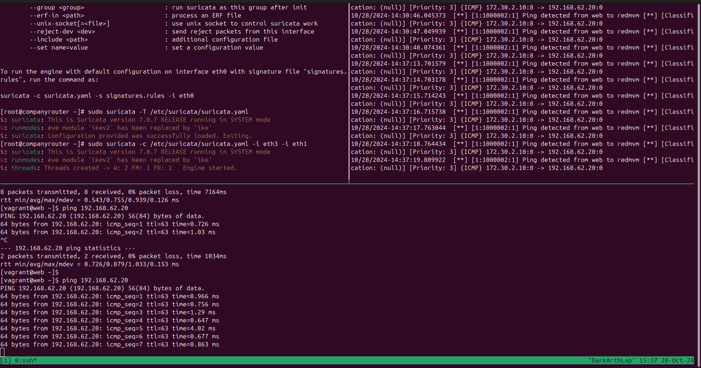

## opdarcht 1

- installeren van kalilinu xom mee te experimenteren in fake internet network
- IP kalilinux = ```192.168.62.20```

## schema



## Netwerkdocumentatie

## 1. IP-configuratie en Netwerkinstellingen

| Naam van de machine        | IP-adres       | Subnet          | Standaard Gateway | DNS Server        | DHCP/Statisch |
| -------------------------- | -------------- | --------------- | ----------------- | ----------------- | ------------- |
| **companyrouter**          | 172.30.255.254 | 172.30.0.0/16   | -                 | -                 | Statisch      |
| **dns**                    | 172.30.0.4     | 172.30.0.0/16   | 172.30.255.254    | Zelf (172.30.0.4) | Statisch      |
| **web**                    | 172.30.0.10    | 172.30.0.0/16   | 172.30.255.254    | 172.30.0.4        | Statisch      |
| **database**               | 172.30.0.15    | 172.30.0.0/16   | 172.30.255.254    | 172.30.0.4        | Statisch      |
| **employee**               | 172.30.0.123   | 172.30.0.0/16   | 172.30.255.254    | 172.30.0.4        | Statisch      |
| **isprouter**              | 192.168.62.254 | 192.168.62.0/24 | -                 | -                 | Statisch      |
| **your_laptop**            | 192.168.62.42  | 192.168.62.0/24 | 192.168.62.254    | 192.168.62.253    | DHCP          |
| **homerouter**             | 172.10.10.254  | 172.10.0.0/24   | 192.168.62.254    | -                 | Statisch      |
| **remote_employee**        | 172.10.10.123  | 172.10.0.0/24   | 172.10.10.254     | 192.168.62.253    | Statisch      |
| **virtualbox_nat_gateway** | 10.0.2.1       | 10.0.2.0/24     | -                 | -                 | -             |
| **virtualbox_nat_dns**     | 10.0.2.3       | 10.0.2.0/24     | 10.0.2.1          | Zelf (10.0.2.3)   | Statisch      |
| **kali_Linux**             | 192.168.62.20  | 192.168.62.0/24 | 192.168.62.254    | 192.168.62.253    | Statisch      |

## uitschakelen zonetransfer + testen

```bash
sudo vi /etc/bind/named.conf

allow-transfer { none; };  # voeg dit toe


dig axfr @172.30.0.4 cybersec.internal

```

- pas vervolgens dit aan

```
sudo service named restart
```
