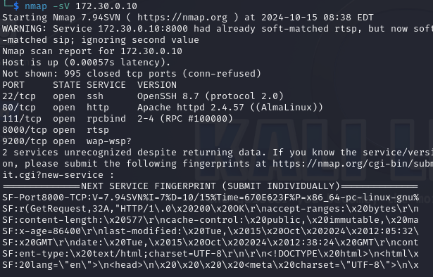

# labo 2 firewalls

## theorie

- FIREWALL LAAG 3 EN 4 (UDP/TCP)

- Review the advantages and disadvantages of a host-based firewall vs a network-based firewall.
  - netwerk firewall is gecentraliseerd en kan tussen 2 netwerken makkelijk forwarding beheren en regels instellen. Nadeel het beschermt minder effectief tegen interne dreigingen.
- DMS met 2 firewalls gaan 1 voor de dms en 1 voor de intern netwerk elk hun eigen regels om zich af te schermen
- Bij het scannen van poorten met nmap:

- **Open**: Poort accepteert verbindingen; een service draait. Nmap ontvangt een geldig antwoord -(bijv. SYN-ACK voor TCP).
- **Filtered**: Nmap kan niet bepalen of de poort open of gesloten is door een firewall of filter. Geen antwoord of een gefilterd antwoord ontvangen.
- **Closed**: Poort is niet in gebruik, geen service draait. Nmap ontvangt een reset (RST) voor TCP of geen antwoord voor UDP.

### systemd theorie

- De bestaande systemd-configuratiebestanden bevinden zich meestal in de mappen /etc/systemd/system/, /lib/systemd/system/, en /usr/lib/systemd/system/ voor systeemconfiguraties.
- eigen systemd maken in /etc/systemd/system/naam.service -> met [unit enz erin,..]
- **systemd timers** alternatief voor cronjobs binne nsystemd configuratie

## labo

### What webserver software is running on web?

- httpd want men cmd werkt niet
- Want ---->`/etc/httpd/`

### wachtwoord en usernme voor databse hackje

commando: ```hydra -l toor -P /usr/share/wordlists/rockyou.txt mysql://172.30.1.15```

```[3306][mysql] host: 172.30.1.15   login: toor   password: summer```

- De **-sC** optie in Nmap activeert de standaard scripts die zijn ontworpen om informatie over de services en kwetsbaarheden op de gescande poorten te verzamelen.
- database verise achterhalen op de database `mysql -V`

### scannen webserver



### netwerk segmentatie oplossingen

- Attack vector verwijst naar de verschillende manieren waarop een aanvaller toegang kan krijgen tot een systeem of netwerk om een aanval uit te voeren.

- Ja, er kan al netwerksegmentatie zijn gedaan op het bedrijfsnetwerk, afhankelijk van de netwerkinfrastructuur en configuratie.

- Een DMZ (Demilitarized Zone) is een beveiligde subnetwerkzone waar publieke diensten, zoals webservers en mailservers, worden geplaatst om ze te scheiden van het interne netwerk.

- Een nadeel van netwerksegmentatie kan zijn dat het de interactie tussen client en server kan bemoeilijken, wat kan leiden tot prestatieproblemen of complexe configuraties.

### segmenteren

zie netwer kschema.  met volledige documentatie 

### CMD WAS KAPPOT IK HEB HET GEFIXED ZIE HIER UUTLEG WAT IK DOE

aanpassen /services script:

```bash
sudo ss -tulnp | grep ':9200'
tcp   LISTEN 0      128          0.0.0.0:9200      0.0.0.0:*    users:(("python",pid=4630,fd=6),("python",pid=4630,fd=5),("python",pid=628,fd=5))  
```

```bash
[root@web conf]# ps -p 628 -o args=
/usr/bin/python /opt/flask/app.py
```

vervolgens ip aanpassen naar nieuwe database: 172.30.1.15

### bug niet vinden cmd

`scp ./files/web/app.jar web:/home/vagrant/app.jar`
vervolgens naar `/opt/insecurewebapp/app.jar`

### isntalleren van nftables en fix opdracht

```bash
sudo apt update
sudo apt install nftables  # Voor Debian/Ubuntu

sudo nano /etc/nftables.conf
```

- de firewall regels: **/etc/nftables.conf**

### isproute rdns doorsturen naar nieuwe ip adres

- webserver ip

```bash
172.30.2.10
```

vervolgens rrestarten en applyen!

```bash
sudo nft flush ruleset
sudo nft -f /etc/nftables.conf
```

nmap vanaf de kali

```nmap -p 80,22,666 172.30.2.10```

### voor /cmd functie heb je sudo rechten

het risico dat je via die tool commandos kan ingeven is dat je u computer naar de frietjes kunt brengen.

```bash
nmap 172.30.0.0/16
```

Scan per host en zie
```nmap 172.30.0.0```

Scan per host en doe banner grab

```bash
nmap -sV 172.30.0.0
```

database met versie:

```bash
3306/tcp open  mysql   MySQL 5.5.5-10.11.8-MariaDB
```
