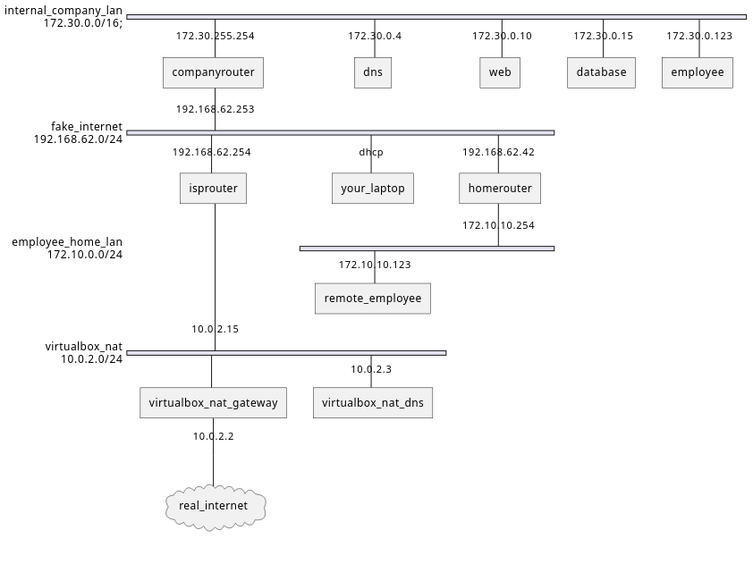
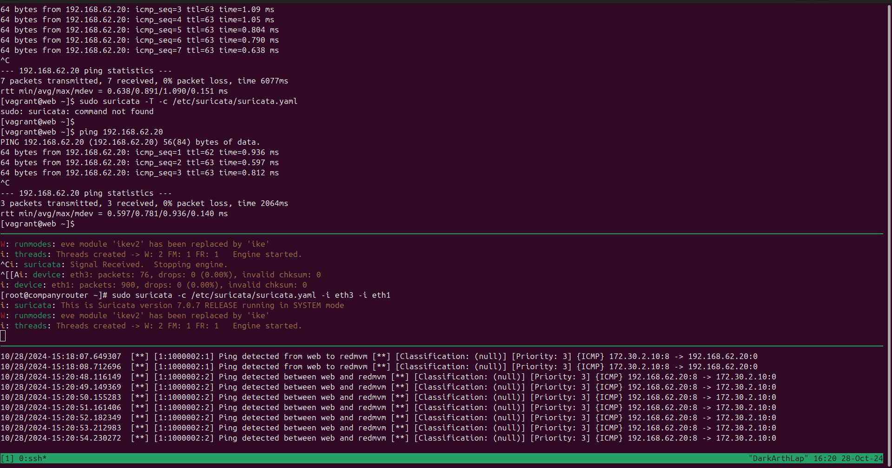
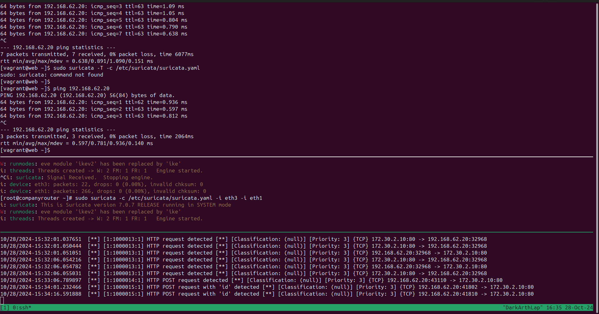
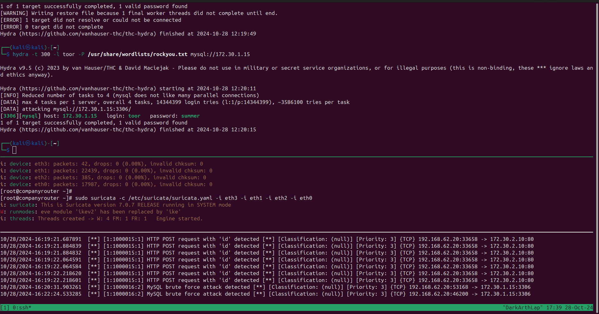

# theorie

1. **Wat is het verschil tussen een IDS en een IPS?**  
   - Een IDS detecteert bedreigingen zonder in te grijpen, terwijl een IPS direct actie onderneemt om bedreigingen te blokkeren.

2. **Wat zijn enkele fundamentele verschillen tussen een firewall en een IDS/IPS, conceptueel?**  
   - Een firewall regelt toegang en filtert verkeer op basis van vooraf ingestelde regels; een IDS/IPS zoekt naar afwijkende patronen en reageert op bedreigingen.

3. **Creëer, begrijp en interpreteer enkele basis Suricata-regels:**

   - **Een regel die een specifiek protocol kan detecteren:**  
     Een voorbeeldregel kan HTTP-verkeer identificeren met “alert http any any -> any any (msg: 'HTTP traffic detected')”.

   - **Een regel die verkeer op een specifieke poort kan detecteren:**  
     Een regel kan verkeer op poort 80 detecteren met “alert tcp any any -> any 80 (msg: 'Port 80 traffic detected')”.

4. **Waar plaats je een fysieke IDS/IPS als deze apart van de firewall is? Hoe stel je dit in? Wat is de impact op het netwerk?**  
   - Plaats de IDS/IPS achter de firewall om netwerkverkeer te scannen; dit kan netwerkvertraging veroorzaken door de extra monitoringlaag.

5. **Wat is Security Onion? Wat is het doel?**  
   - Security Onion is een open-source platform voor netwerkmonitoring en bedreigingsdetectie, bedoeld om beveiligingsincidenten te detecteren en beheren.
   - fysieke apparatuur met alle apparatuur en tools en software om te helpen voor netwerk te beveiligen. zoals wazoo en andere apparatuur.


# labo

### we gaan alles van de ids en ips zetten op de router want daar komt all het interessante verkeer vandaan.

- configruatie voor surricata
`/etc/suricata/suricata.yaml`
- af-packet --> interfaces declareren!!!
`eth1 en eth3 instellen dat is de kali netwerk en dmz!!!!`


###  What is the difference between the fast.log and the eve.json files?
- De fast.log file geeft korte, overzichtelijke meldingen van detecties, ideaal voor snelle analyses. De eve.json file daarentegen bevat gedetailleerde informatie in JSON-formaat, geschikt voor geavanceerde loganalyse en integratie met andere systemen.

### Create a rule that alerts as soon as a ping is performed between two machines (for example red and THE WEB)

sudo nano /etc/suricata/my.rules
```
alert icmp 172.30.2.10 any <> 192.168.62.20 any (msg:"Ping detected between web and redmvm"; itype:8; sid:1000002; rev:2;)

```
sudo nano /etc/suricata/suricata.yaml
```
rule-files:
  - suricata.rules
  - my.rules
```
`sudo suricata -c /etc/suricata/suricata.yaml -i eth3 -i eth1 -i eth2 -i eth0`

- vervolgens ping van kali of van web naar de andere! en check de logs in:
  - `sudo tail -F /var/log/suricata/fast.log`


**oplossing**




### Test your out-of-the-box configuration and browse on your red machine to http://www.cybersec.internal/cmd and enter "id" as an evil command. Does it trigger an alert? If not, are you able to make it trigger an alert?

- /root/my.rules
-   ```
    alert http any any -> any any (msg:"HTTP POST request with 'id' detected"; content:"POST"; http_method; content:"id"; http_client_body; sid:1000015; rev:1;)
    ```
    **oplossing**
    


### Create an alert that checks the mysql tcp port and rerun a hydra attack to check this rule. Can you visually see this bruteforce attack in the fast.log file? Tip: monitor the file live with an option of tail.

-   ```
    alert tcp any any -> 172.30.1.15 3306 (msg:"MySQL brute force attack detected"; flow:to_server; threshold: type both, track by_src, count 3, seconds 60; sid:1000016; rev:2;)
    ```

-    **oplossing**
    


### Go have a look at the Suricata documentation. What is the default configuration of Suricata, is it an IPS or IDS?

- dit is standaard een ids dus alleen detection
```bash
af-packet:
# LISTENMODE=af-packet
LISTENMODE=nfqueue
```
### verschil tussen firewall en ids/ips

- het verschik is dat een ids/ips  ook filtert op de applicatie laag en de data, Waardoor inhoudelijk veel dieper kan gezocht worden. Een firewall werkt op een andere manier waarbij het startpunt en eindpunt wordt gecontroleerd op basis van layer 3 netwerklaag.

### An IPS/IDS needs to be tuned thoroughly to prevent alerting fatigue, so it is good that you learn how to write your own rules. Fortunately, there are also rule sets out there that can help you. Read the rule management documentation for Suricata and import the Emerging Threats Open ruleset. Find a way to demonstrate that these additional rules work.

- pas extra regel toe in rule-file