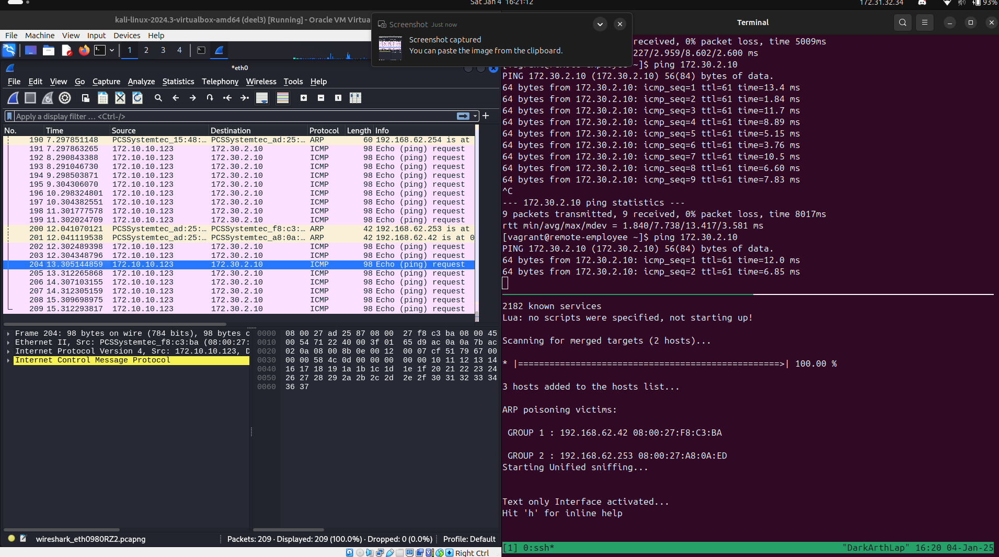

# labo 9 ipsec

## theorie

Wat is het fundamentele doel van IPsec?

IPsec biedt veilige communicatie over een onveilig netwerk door gegevens te versleutelen, authenticeren en beschermen tegen manipulatie.
Hoe werkt IPsec? Wat zijn SP's en SA's?

IPsec werkt via policies (SP's: Security Policies) die bepalen welke gegevens beveiligd worden. SA's (Security Associations) zijn specifieke afspraken over hoe de beveiliging (zoals versleuteling) wordt uitgevoerd.
Welke modes bestaan er in IPsec? Wat is het verschil?

    Transport Mode: Alleen de payload van het pakket wordt beveiligd.
    Tunnel Mode: Het hele IP-pakket wordt ingekapseld en beveiligd.
    Tunnel mode is vaak voor VPN's, transport mode voor directe verbindingen.

Wat is AH?

Authentication Header (AH) biedt integriteit en authenticatie, maar geen versleuteling van de gegevens.
Wat is ESP?

Encapsulating Security Payload (ESP) biedt versleuteling, integriteit en optionele authenticatie.
Wat is IKE?

Internet Key Exchange (IKE) is een protocol dat sleuteluitwisseling en SA's automatiseert en beheert voor IPsec.

## labo

- ip routes toevoegen niet via isp router\

```shell
# companyrouter eth1 ->/etc/sysconfig/network-scripts/route-eth1
172.10.0.0/24 via 192.168.62.42
#HomeRouter -> /etc/sysconfig/network-scripts/route-eth1
172.30.1.0/24 via 192.168.62.253
172.30.2.0/24 via 192.168.62.253
172.30.3.0/24 via 192.168.62.253
```

doe hierna voor beide routers
`sudo systemctl restart NetworkManager`
en
`ip route show`

- spoofing doen op kali: `sudo ettercap -Tq -i eth0 -M arp:remote /192.168.62.42// /192.168.62.253//`

- take a look at the man page of ettercap why there is one slash (/) in front and 2 slashes (//) after the IPs?

`In de ARP poisoning-modus (-M arp:remote), moet je dubbele schuine streepjes (//) achter de IP-adressen gebruiken om Ettercap te vertellen de ARP-poisoning uit te voeren. Een enkele schuine streep (/) wordt gebruikt wanneer je een host of netwerk specificeert in andere delen van het programma of voor reguliere IP-matching.`

### demo
```bash
sudo nft flush ruleset
sudo nft -f /etc/nftables.conf
```

onderste 2 beide in vagrant home folder!
- `ssh cr ->sudo ./ipsec.sh`
- `ssh hr -> sudo ./ipsec.sh`
ssh kali -> `sudo ettercap -Tq -i eth0 -M arp:remote /192.168.62.42// /192.168.62.253//`
wireshark-> preferences -> protocols -> esp -> vink **3 bovenste** vakje aan of uit!
ssh remote_employee -> `ping 172.30.2.10` (web)

